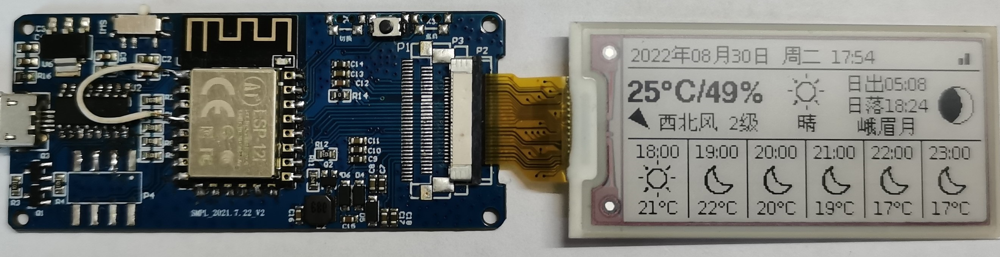

# E-Ink Assistant
# 墨水屏智能助理

基于 ESP8266/~~ESP32~~(未来支持) 使用 Arduino 开发的墨水屏应用, 具有时钟, 日历, 天气等功能

可启用深度休眠模式, 休眠电流<1mA

本程序高度自由可配置, 且提供接口可自行扩展, 目前自带的扩展有一言, Bilibili 粉丝数显示等



## 所需硬件
### MCU
目前仅支持 ESP8266, 模块的 FLASH 容量需要大于 1M, 如启用 OTA 则需要大于 2MB

未来还将支持 ESP32

### 驱动板
支持各种微雪, 立创或b站大佬开源的驱动板, 如果有能力的话甚至可以自行设计, 只需在 config.h 中配置引脚即可

我使用的驱动板是从某鱼上购买的 ESP8266 墨水屏开发板, 板子上的丝印是 SMPL_2021.7.22_V2, 如果你凑巧也在使用这块驱动板, 则可以使用我的引脚设置

### 墨水屏
目前仅支持 2.13 寸墨水屏, 但未来将支持不同尺寸的屏幕

支持微雪, 大连佳显, 汉朔等 GxEPD2 库支持的各种屏幕

除此之外, 我还为 ses imagotag VUSION 2.2 BWR GL420 电子价签上拆下来的屏幕做了适配, 型号为 LE2213ES09, 该屏幕为 Pervasive Displays 生产, 定义及命令基本与微雪的屏幕一致, 只不过 busy 的电平正好相反

研究过程: [我的博客](https://dawncraft.cc/2021/12/%E4%BA%8C%E6%89%8B%E5%A2%A8%E6%B0%B4%E5%B1%8F%E6%8A%98%E8%85%BE%E8%AE%B0/)

参考: [https://www.mydigit.cn/thread-278494-1-1.html](https://www.mydigit.cn/thread-278494-1-1.html)

### 电源
如果直接供电, 不使用电池的话可以通过宏或自行修改去除电量显示, 若使用电池则需要自行编写 EInkAssistant.ino 中的获取电量百分比函数, 通过模数转换(**ESP8266 的 ADC 电压不能超过 1V**)或其他方式获取电池电压并计算电量

**注意: 若直接供电, 一定要关闭电量显示或让电量百分比函数返回大于5的数值, 否则在电量低于5%时会强制进入深度休眠模式**

ESP8266 支持深度休眠, 若启用深度休眠则需连接 GPIO16 和 RST 引脚, 详情请见数据手册, 但由于深度休眠状态下无法响应中断, 所以按键等功能也无法使用, 只能重新启动

### 外壳
自己动手, 丰衣足食(

## 编译指南
### 安装 Arduino 和第三方库
- [ESP8266-Arduino](https://github.com/esp8266/Arduino)
- [ESP_EEPROM](https://github.com/jwrw/ESP_EEPROM)
- [Adafruit GFX](https://github.com/adafruit/Adafruit-GFX-Library)
- [U8g2_for_Adafruit_GFX](https://github.com/olikraus/U8g2_for_Adafruit_GFX)(**注意: 需要安装补丁, 请参照下方步骤**)
- [GxEPD2](https://github.com/ZinggJM/GxEPD2)
- [qrcode](https://github.com/ricmoo/QRCode)
- [ArduinoJSON](https://github.com/bblanchon/ArduinoJson)
- [ArduinoUZlib](https://github.com/tignioj/ArduinoUZlib)

### 安装 U8g2_for_Adafruit_GFX 大字库补丁
应用 U8g2_for_Adafruit_GFX/src 目录中的补丁

或者进入 Arduino 库目录, 在 U8g2_for_Adafruit_GFX/src/u8g2_fonts.h 的第 60 行插入以下代码即可
```c
#if defined(__GNUC__) && defined(ESP8266)
#  define U8X8_FONT_SECTION(name) U8X8_SECTION(".irom0.text." name)
#  define u8x8_pgm_read(adr) pgm_read_byte_near(adr)
#  define U8X8_PROGMEM PROGMEM
#endif
```
相关issue: [U8g2_for_Adafruit_GFX#29](https://github.com/olikraus/U8g2_for_Adafruit_GFX/issues/29)

### 修改配置
首先根据您的需求修改 config.h 中的配置, 别忘了填写和风天气 KEY

ESP8266 需要将烧录设置中的 Flash Size 设置为 `2MB (FS:none OTA:~1019KB)`

### 编译并烧录
确认 USB 转串口芯片的驱动安装好后就可以进行烧录了, 具体的教程网上到处都是, 就不赘述了

烧录成功后重启 MCU, 然后根据提示扫码配网即可, 使用 ~~我的小程序(开发中, 敬请期待)~~ 或者直接请求 HTTP 接口还可以修改配置

HTTP 接口文档: [点击查看](https://www.apifox.cn/apidoc/shared-2f2e3765-a49a-4309-8c16-17193d901266)

## 自定义布局
在 initPages 函数中调用 addPage 函数可以添加一页, 在页面绘制回调里就可以绘制您的自定义布局了, 具体步骤可以参考我写的代码

需要注意的是, 默认添加的第一页为首页, 在无操作 SLEEP_TIMEOUT 秒后会进入深度休眠模式, ESP8266 在休眠模式下无法响应按键, 只能重启, 其他页面则不会进入休眠模式

## 工具
所有用到的工具都存放在 tools 目录下, 其中:
- Img2Code.jar 用于生成位图
- convert.bat 用于生成普通字体代码(来自[u8g2字体生成器](https://github.com/breakstring/u8g2_fontmaker))
- icon.bat 用于生成图标字体代码
- generate_switch.py 用于为和风天气图标生成那一大堆的switch语句

你也可以用以上工具添加自己的字体和图片

## 版权声明
本项目采用 GPLv3/商用双许可 授权, 个人非商业使用在遵守 GPLv3 协议的前提下可免费使用, 如需商用, 请联系 wc@mail.dawncraft.cc 商议详情

- [和风天气](https://dev.qweather.com/): 个人非商业免费使用, 商用请向和风天气购买授权
- [Hitokoto - 一言](https://hitokoto.cn/)
- [文泉驿点阵宋体](https://github.com/larryli/u8g2_wqy): GPL
- [和风天气图标](https://icons.qweather.com/): MIT
- [Bilibili图标](https://github.com/dashuchufang/bili_icon_pack): 版权归 Bilibili 所有

本项目在开发的过程中也参考了一些其他项目, 在此一并致以感谢:
- [G6EJD/ESP32-e-Paper-Weather-Display](https://github.com/G6EJD/ESP32-e-Paper-Weather-Display)
- [breakstring/毒鸡汤墨水屏日历](https://github.com/breakstring/eInkCalendarOfToxicSoul)
- [甘草酸不酸/天气墨水屏](https://gitee.com/Lichengjiez/weather-ink-screen)
