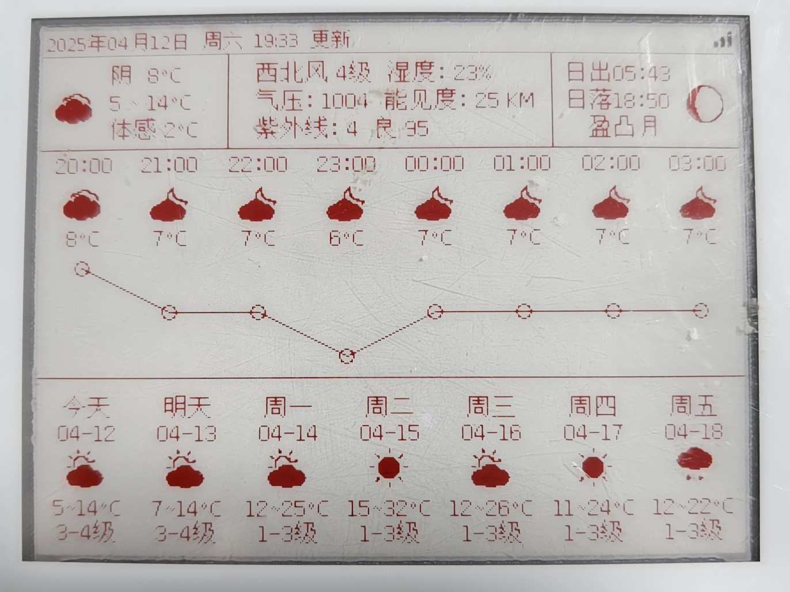

# E-Ink Assistant
# 墨水屏智能助理

基于 ESP8266/ESP32 使用 Arduino 开发的墨水屏应用, 具有时钟, 日历, 天气等功能

可启用深度休眠模式, 休眠电流 <1mA

本程序高度自由可配置, 且提供接口可自行扩展, 目前自带的扩展有一言, Bilibili 粉丝数显示等




演示视频:

<iframe src="//player.bilibili.com/player.html?isOutside=true&aid=1251165708&bvid=BV1UJ4m1e7sX&cid=1452084253&p=1" scrolling="no" border="0" frameborder="no" framespacing="0" allowfullscreen="true"></iframe>

## 所需硬件

### MCU

ESP8266 模块的 FLASH 容量需要大于 1M, 如启用 OTA 则需要大于 2MB

ESP32 没有特殊要求, ESP32/ESP32-C3/ESP32-S2/ESP32-S3 均可使用

### 驱动板

支持各种微雪, 立创或b站大佬开源的驱动板, 如果有能力的话甚至可以自行设计, 只需在 src/config.h 中配置引脚即可

我使用的驱动板是从某鱼上购买的 ESP8266 墨水屏开发板, 板子上的丝印是 SMPL_2021.7.22_V2, 如果你凑巧也在使用这块驱动板, 则可以使用我的引脚设置

### 墨水屏

本项目将屏幕分为五种尺寸, 分别为 XS, SM, MD, LG 和 XL, 并针对每种尺寸的屏幕单独设计布局, 而 API 请求等代码则是共享的, 这样可以最大化复用代码, 减少开发和维护成本

各种尺寸对应的屏幕尺寸和分辨率如下:

- XS: 1.54 寸, <=200x200
- SM: 2.13/2.66/2.9 寸
- MD: 3.5 寸, >=300x200
- LG: 4.2 寸, >=400x300
- XL: 7.5 寸, >=800x480
- CUSTOM: 为所有界面的空实现, 供用户自行适配屏幕或自定义布局

支持微雪, 大连佳显, 汉朔等 GxEPD2 库支持的各种屏幕

除此之外, 本项目还尽力为一些从电子价签中拆下的二手屏幕提供支持, 这些屏幕可能因为已经过时或为 OEM 定制版而不受 GxEPD2 库官方支持, 本项目通过继承重写和对 GxEPD2 打补丁来实现对这些屏幕的支持, 详情请见 src/GxEPD2_Extra.h

1. ses imagotag VUSION 2.2 BWR GL420 电子价签, 型号为 LE2213ES09, 该屏幕为 Pervasive Displays 生产, 定义及命令基本与微雪的屏幕一致, 只不过 busy 的电平正好相反

   研究过程: [我的博客](https://dawncraft.cc/2021/12/%E4%BA%8C%E6%89%8B%E5%A2%A8%E6%B0%B4%E5%B1%8F%E6%8A%98%E8%85%BE%E8%AE%B0/)

   参考: [https://www.mydigit.cn/thread-278494-1-1.html](https://www.mydigit.cn/thread-278494-1-1.html)

2. 老王 2.13/2.9/4.2 寸电子价签, 价签上无品牌标签, 屏幕型号为 WFT0213CZ16/WFT0290CZ10/WFT0420CZ15, 该屏幕与微雪的旧版屏幕基本一致, 但 busy 电平相反

   感谢 @lixiangwuxian 在点亮这块屏幕过程中的帮助

### 电源

如果直接供电, 不使用电池的话可以通过宏或自行修改去除电量显示, 若使用电池则需要自行编写 src/main.cpp 中的获取电量百分比函数, 通过模数转换(**ESP8266 的 ADC 电压不能超过 1V**)或其他方式获取电池电压并计算电量

**注意: 若直接供电, 一定要关闭电量显示或让电量百分比函数返回大于5的数值, 否则在电量低于 5% 时会强制进入深度休眠模式**

ESP8266 支持深度休眠, 若启用深度休眠则需连接 GPIO16 和 RST 引脚, 详情请见数据手册, 但由于深度休眠状态下无法响应中断, 所以按键等功能也无法使用, 只能重新启动

ESP32 无需修改外部电路即可实现深度休眠, 但目前尚未经过完全测试, 可能存在 bug

### 外壳

自己动手, 丰衣足食(

## 编译指南

### 使用 PlatformIO 编译 (推荐)

**可自动安装库并打补丁, 但需编写开发板配置, 适合有一定经验的开发者**

使用 PlatformIO 打开项目, 在 platformio.ini 中增加您的开发板对应的配置, 然后修改 src/config.h 中的配置, 选择对应的 Target 编译并烧录即可

点击 Custom 中的 `Upgrade OTA` 目标可一键在线升级 (需安装 Python3 并装有 requests 库)

### 使用 Arduino IDE 编译 (不推荐)

**需手动安装库并自行为库打补丁, 但可使用菜单进行图形化配置, 适合新手**

<details>
<summary>展开查看</summary>

#### 安装 Arduino 和第三方库

- [ESP8266-Arduino](https://github.com/esp8266/Arduino) (esp8266)
- [arduino-esp32](https://github.com/espressif/arduino-esp32) (esp32) (**注意: 需修改库, 否则会与 qrcode 库冲突**)
- [ESP_EEPROM](https://github.com/jwrw/ESP_EEPROM)
- [Adafruit GFX](https://github.com/adafruit/Adafruit-GFX-Library)
- [U8g2_for_Adafruit_GFX](https://github.com/olikraus/U8g2_for_Adafruit_GFX)(**注意: 需要安装补丁, 请参照下方步骤**)
- [GxEPD2](https://github.com/ZinggJM/GxEPD2)
- [qrcode](https://github.com/ricmoo/QRCode)
- [ArduinoJSON](https://github.com/bblanchon/ArduinoJson)(**注意: 请安装6.21.5或以下版本，否则无法构建**)
- [ArduinoUZlib](https://github.com/tignioj/ArduinoUZlib)

#### 解决 arduino-esp32 与 qrcode 库的头文件冲突问题

进入 arduino-esp32 中的 qrcode 目录, 一般为 %localappdata%\Arduino15\packages\esp32\hardware\\<芯片型号\>\\<库版本号\>\tools\sdk\esp32\include\qrcode\include\qrcode.h

将 qrcode.h 改为其他文件名, 例如改成 qrcode_esp.h

#### 安装 U8g2_for_Adafruit_GFX 大字库补丁

进入 Arduino 库目录, 在 U8g2_for_Adafruit_GFX/src/u8g2_fonts.h 的第 60 行插入以下代码

```c
#if defined(__GNUC__) && defined(ESP8266)
#  define U8X8_FONT_SECTION(name) U8X8_SECTION(".irom0.text." name)
#  define u8x8_pgm_read(adr) pgm_read_byte_near(adr)
#  define U8X8_PROGMEM PROGMEM
#endif
```

相关 issue: [U8g2_for_Adafruit_GFX#29](https://github.com/olikraus/U8g2_for_Adafruit_GFX/issues/29)

#### 修改开发板配置

ESP8266 需要将烧录设置中的 Flash Size 设置为 `2MB (FS:none OTA:~1019KB)`

ESP32 需要将烧录设置中的 Partition Scheme 设置为 `No FS 4MB (2MB APP x2)`, 如果没有这个选项则可以选择 `RainMaker 4MB`

</details>

### 修改配置

根据您的需求修改 src/config.h 中的配置, 别忘了填写和风天气 KEY

### 编译并烧录

确认 USB 转串口芯片的驱动安装好后就可以进行烧录了, 具体的教程网上到处都是, 就不赘述了

烧录成功后重启 MCU, 然后根据提示扫码配网即可, 使用 ~~我的小程序(开发中, 敬请期待)~~ 或者直接请求 HTTP 接口还可以修改配置

HTTP 接口文档: [点击查看](https://www.apifox.cn/apidoc/shared-2f2e3765-a49a-4309-8c16-17193d901266)

## 自定义布局

在 src/main.cpp 的 initPages 函数中调用 addPage 函数可以添加一页, 在页面绘制回调里就可以绘制您的自定义布局了, 具体步骤可以参考我写的代码

需要注意的是, 默认添加的第一页为首页, 在无操作 SLEEP_TIMEOUT 秒后会进入深度休眠模式, ESP8266 在休眠模式下无法响应按键, 只能重启, 其他页面则不会进入休眠模式

为了适配不同尺寸的屏幕, 当前的页面绘制回调中会使用模板元编程来选择屏幕尺寸对应的布局绘制函数, 对应 src/ui_\<尺寸\>.cpp. 如需完全自定义布局, 可将 src/config.h 中的 UI_RESOLUTION 宏定义为 UISize::CUSTOM, 然后实现 src/ui_custom.cpp 中的各个布局绘制函数存根

## 工具

所有用到的工具都存放在 tools 目录下, 其中:

- Img2Code.jar 用于生成位图
- convert.bat 用于生成普通字体代码 (来自 [u8g2字体生成器](https://github.com/breakstring/u8g2_fontmaker))
- icon.bat 用于生成图标字体代码
- generate_switch.py 用于为和风天气图标生成那一大堆的switch语句
- patch.py 用于给 u8g2 等库打补丁, 来自 <https://github.com/techtonik/python-patch>

你也可以用以上工具添加自己的字体和图片

## 版权声明

本项目采用 GPLv3/商用双许可 授权, 个人非商业使用在遵守 GPLv3 协议的前提下可免费使用, 如需商用, 请联系 [wc@mail.dawncraft.cc](mailto://wc@mail.dawncraft.cc) 商议详情

- [和风天气](https://dev.qweather.com/): 个人非商业免费使用, 商用请向和风天气购买授权
- [Hitokoto - 一言](https://hitokoto.cn/)
- [文泉驿点阵宋体](https://github.com/larryli/u8g2_wqy): GPL
- [和风天气图标](https://icons.qweather.com/): MIT
- [Bilibili图标](https://github.com/dashuchufang/bili_icon_pack): 版权归 Bilibili 所有

本项目在开发的过程中也参考了一些其他项目, 在此一并致以感谢:

- [G6EJD/ESP32-e-Paper-Weather-Display](https://github.com/G6EJD/ESP32-e-Paper-Weather-Display)
- [breakstring/毒鸡汤墨水屏日历](https://github.com/breakstring/eInkCalendarOfToxicSoul)
- [甘草酸不酸/天气墨水屏](https://gitee.com/Lichengjiez/weather-ink-screen)
